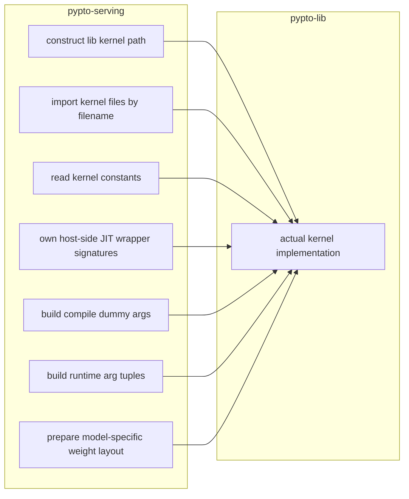
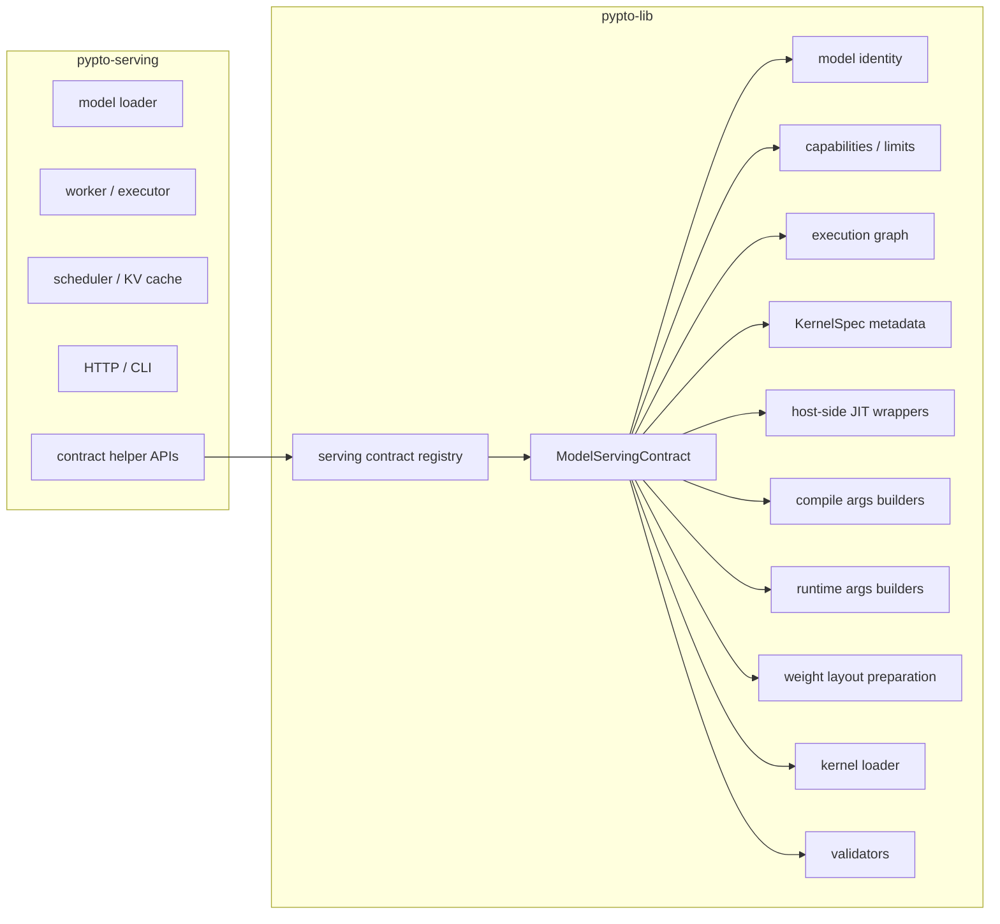
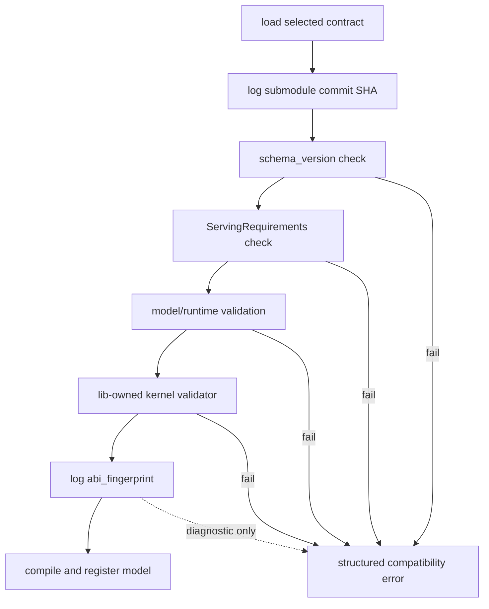
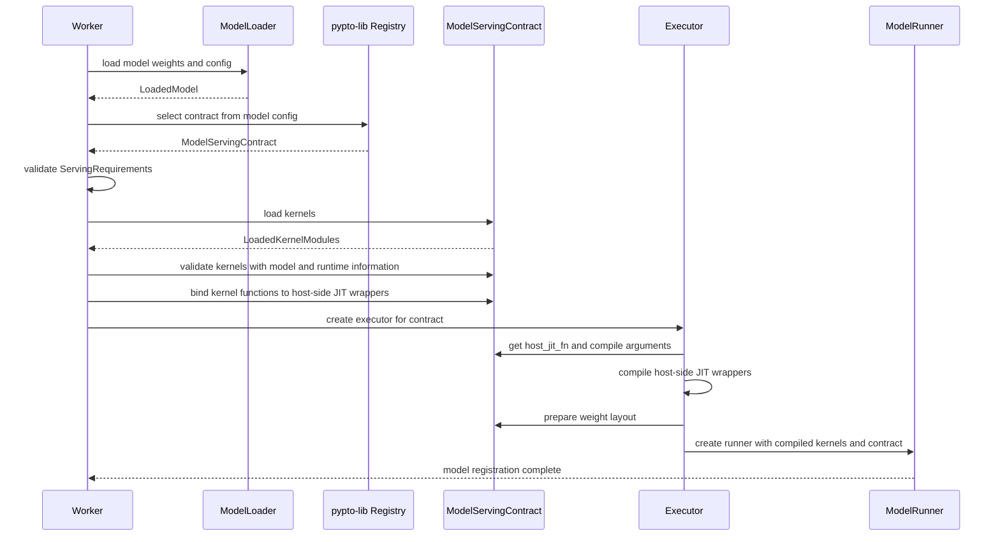
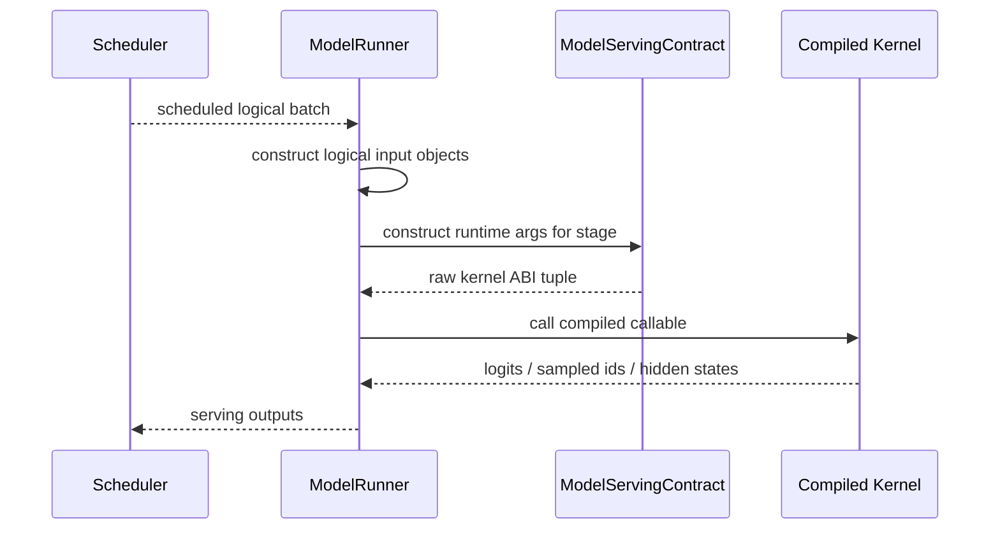

# Lib-Serving Decoupling Architecture Design

## 1. Background and Problem

From the repository's intended architecture, `pypto-serving` owns the online serving runtime, including model loading, worker lifecycle management, request scheduling, KV cache management, kernel compilation orchestration, and the HTTP/CLI entry points. `pypto-lib` owns model kernels, the kernel ABI, model-specific layouts, and lower-level execution logic.

Today, `pypto-serving` directly copies a large amount of `pypto-lib` internal knowledge in order to drive the Qwen3-14B kernels. This includes kernel file paths, file names, function names, host-side JIT wrapper argument order, compile dummy arguments, runtime argument tuples, weight layout keys, kernel constant names, and model name inference rules.

This design made it possible to integrate one concrete model quickly, but it also created hard-coded coupling between the two repositories. Whenever the `pypto-lib` kernel ABI changes, `pypto-serving` must be updated in lockstep; otherwise, failures usually surface only during compilation or runtime.

The main forms of coupling are:

- Kernel file path coupling: serving constructs paths under `pypto-lib/models/...`.
- Kernel file name coupling: serving loads modules by file names such as `prefill_fwd.py` and `decode_layer.py`.
- Host-side JIT wrapper signature coupling: serving maintains wrappers that must match the kernel ABI.
- Compile dummy argument coupling: serving builds model-specific dummy tensors for JIT compilation.
- Runtime argument order coupling: serving constructs tuples in the order required by kernel signatures.
- Weight layout coupling: serving knows the weight keys, transposes, padding rules, and layer stacking rules required by kernels.
- Model inference coupling: serving guesses the contract from model names, paths, or architecture strings.
- Kernel constant coupling: serving reads module constants such as `BATCH`, `VOCAB`, and `NUM_LAYERS`.

These forms of coupling create the following architectural problems:

- The two repositories must be changed together, and changes in one repository can easily break the other.
- Serving duplicates lib kernel ABI knowledge, creating a second source of truth.
- New model integration tends to accumulate `if model_name...` branches in serving.
- Compatibility failures lack structured diagnostics and often appear as import, shape, or runtime errors.
- Models beyond Qwen3, such as DeepSeek-V4 Flash/Pro, will amplify the existing coupling.

## 2. Goals and Non-Goals

Design goals:

- Make `pypto-lib` the single source of truth for the model serving ABI.
- Keep `pypto-serving` responsible only for serving runtime orchestration, without owning model kernel ABI details.
- Preserve the current Qwen3-14B serving path.
- Leave extension points for DeepSeek-V4 Flash/Pro and future models.
- Drive compatibility checks from contract contents instead of manually maintained model version numbers.
- When an ABI is incompatible, report the specific contract, field, and suggested action.

Non-goals:

- This design does not require replacing the submodule with a package. The submodule can remain the current mechanism for exact reproducibility.
- This design does not move shared scheduler, HTTP, CLI, or worker logic into `pypto-lib`.
- This design does not express model kernel ABI details on the serving side.
- This design does not finalize a cross-model `ModelConfig` schema.
- This design does not require all future models to share the same execution graph, weight layout, or runtime argument structure.

## 3. Overall Architecture

Before the refactor, `pypto-serving` directly reads internal `pypto-lib` implementation details:



After the refactor, `pypto-serving` consumes only structured contracts exposed by `pypto-lib` through a contract registry:



Repository responsibility boundaries:

`pypto-lib` owns:

- model-specific serving ABI
- kernel file layout
- kernel function mapping
- kernel constant interpretation
- host-side JIT wrapper signatures
- compile-time argument construction
- runtime kernel argument construction
- weight layout preparation
- model/kernel compatibility validation

`pypto-serving` owns:

- model loading orchestration
- runtime limits and request-facing configuration
- executor selection
- kernel compilation orchestration
- batching and scheduling
- KV cache allocation
- worker lifecycle
- HTTP and CLI surfaces

Cross-boundary constraints:

- Serving does not directly concatenate lib kernel paths.
- Serving does not import kernels by file name.
- Serving does not read model-specific kernel constants.
- Serving does not own model-specific host-side JIT wrapper signatures.
- Serving does not duplicate kernel argument tuple ordering.
- Serving does not duplicate model-specific weight layouts.

## 4. Detailed Design

### 4.1 Contract Registry and Model Selection

The contract registry is the model selection boundary between serving and lib. It receives an explicit family/variant or model metadata parsed from the model directory, then returns the matching `ModelServingContract`.

Input forms:

- Explicit family / variant, such as `("qwen3", "14b")`.
- Loaded model configuration metadata, such as architecture, model type, hidden size, layer count, attention/MoE/quantization fields.

Output forms:

- The matched `ModelServingContract`.
- If the model family is planned but not yet implemented, a clear not implemented error.
- If the model is unsupported, an unsupported contract error.

Matching principles:

- Each contract defines the structured fields required for matching.
- Serving does not infer the model family from the model name, directory name, or string containment checks.
- Unsupported model errors should include diagnostic information such as `model_id`, architecture, and `model_type`.

Multi-model extension:

- Qwen3-14B is an independent contract.
- DeepSeek-V4 Flash and DeepSeek-V4 Pro should be independent contracts.
- New models are integrated by adding new lib contracts.
- Serving should add at most an executor class mapping, not kernel ABI details.

### 4.2 `ModelServingContract`

`ModelServingContract` is the top-level description of a model serving ABI. It describes the capabilities, limits, execution graph, kernel metadata, weight layout, and hooks exposed by a model contract to serving.

Core fields:

- `schema_version`: the format version of the contract schema.
- `model`: stable model identity, including family, variant, size, quantization, and similar fields.
- `capabilities`: capabilities supported by the model contract, such as paged KV, chunked prefill, and device greedy sampling.
- `limits`: model/kernel limits, such as batch size, maximum sequence length, vocabulary size, and page size.
- `resources`: resources required for model execution.
- `cache`: KV cache layout and page metadata.
- `execution`: the stage graph for serving phases such as prefill and decode.
- `kernels`: mapping from logical kernel stages to `KernelSpec`.
- `weights`: model weight layout metadata.
- `kernel_binder`: binds loaded kernel functions to lib-owned host wrappers.
- `prepare_weights`: model-specific weight layout preparation function.
- `load_kernels`: lib-owned kernel loader.
- `validate_kernels`: lib-owned kernel/module/model validation function.

The key point of `ModelServingContract` is to expose only the structured ABI information that serving must know. The actual kernel files, constant names, and internal module organization remain implementation details owned by lib.

### 4.3 `KernelSpec`

`KernelSpec` describes a logical kernel stage. Serving does not directly care about kernel file names or the module that contains a Python function; it only cares about the ABI metadata exposed by this stage for a serving phase.

Core fields:

- `name`: logical stage name, such as `prefill` or `decode`.
- `public_name`: stable name for logging and profiling, such as `qwen3.prefill`.
- `runtime_args`: ordered argument metadata, including name, dtype, shape expression, and direction.
- `outputs`: logical outputs produced by the kernel stage.
- `capabilities`: capabilities provided by the stage.
- `host_jit_fn`: lib-owned host-side JIT wrapper function.
- `compile_args_builder`: builder for compile dummy arguments.
- `runtime_args_builder`: builder that maps logical runtime inputs to the raw kernel ABI tuple.

The purpose of `KernelSpec` is to keep ABI changes inside the lib contract. Serving uses `KernelSpec` to orchestrate compilation and execution, but it does not duplicate signatures.

### 4.4 `LoadedKernelModules`

`LoadedKernelModules` is the return value from the lib kernel loader. It contains loaded kernel functions and extracted kernel constants.

Fields:

- `functions`: mapping from logical function name to callable.
- `constants`: structured constants dictionary.

Ownership:

- Kernel directory layout is owned by lib.
- Kernel filename mapping is owned by lib.
- Kernel constant names and semantics are owned by lib.
- Serving only receives structured loading results and follows the repository responsibility boundaries defined in Section 3.

### 4.5 `ServingRequirements`

`ServingRequirements` is serving's generic requirement declaration for a contract. It is not a model ABI version; it describes the conditions that a contract must satisfy for the serving runtime.

Fields:

- `schema_version`: the contract schema that serving can parse.
- `required_phases`: phases required by serving, such as `prefill` and `decode`.
- `required_capabilities`: mandatory capabilities, such as paged KV.
- `optional_capabilities`: capabilities that serving can use but does not require.

Validation semantics:

- A schema mismatch means serving cannot parse the contract.
- A missing phase means the execution graph cannot satisfy the serving flow.
- A missing capability means the contract cannot satisfy the current serving runtime mode.

### 4.6 `ExecutionGraphSpec`

`ExecutionGraphSpec` describes the mapping from serving phases to kernel stages.

Example:

```text
prefill -> prefill, greedy_sample
decode  -> decode
```

This structure allows future models to have different execution graphs:

- Multi-stage prefill.
- Separate sample or embedding stages.
- MoE- or MLA-specific stages.
- Different graphs for different variants.

Serving invokes logical stages by phase instead of assuming a fixed set of four kernels.

### 4.7 Kernel Loading

Kernel loading is fully owned by the lib contract.

The lib-side loader is responsible for:

- Locating the kernel directory.
- Maintaining the mapping from logical stages to file names, modules, and functions.
- Loading kernel functions.
- Reading and interpreting kernel constants.
- Returning `LoadedKernelModules`.

Serving-side API calls:

```python
loaded_kernels = contract_load_kernels(contract)
contract_validate_kernels(contract, loaded_kernels, model)
bind_contract_kernel_functions(contract, **loaded_kernels.functions)
```

Kernel constant mismatch errors are produced by the lib validator. Serving only calls the loader, validator, and binder, while following the repository responsibility boundaries defined in Section 3.

### 4.8 Host-Side JIT Wrappers and Compile Arguments

A host-side JIT wrapper refers to the PyPTO `pl.jit.host` layer: the host-side JIT boundary that connects Python orchestration logic to PyPTO kernel calls. It is owned by lib. The wrapper signature must match the kernel ABI, so it belongs to the lib-side serving ABI rather than serving runtime orchestration logic.

Design:

- Lib defines host-side JIT wrappers.
- Lib receives the actual loaded kernel functions through a binder.
- Serving obtains the host JIT function through `contract_host_jit_fn(contract, stage)`.
- Serving does not maintain wrapper signatures.

Compile arguments are generated by lib builders:

```python
dummy_args = contract_compile_args(contract, stage, model_config, runtime_config)
compiled = host_jit_fn.compile(*dummy_args, config=run_config)
```

Design benefits:

- Kernel signature changes require changes only in the lib contract.
- The serving compile flow remains generic.
- Compile-time shape and dtype rules are not duplicated in serving.

### 4.9 Runtime Arguments and Execution Flow

The serving runner constructs only logical inputs, such as prefill hidden states, sequence lengths, block tables, slot mappings, static weight records, and KV cache pages.

The lib-side runtime argument builder is responsible for:

- Mapping logical inputs to the raw kernel ABI tuple.
- Maintaining kernel argument order.
- Handling model-specific optional outputs.
- Handling contract-specific parameters such as device sampling and device embedding.

Serving dispatch flow:

```python
args = contract_runtime_args(contract, stage, inputs, static, **runtime_objects)
compiled_callable(*args)
```

Serving may know the logical concepts, but raw argument ordering stays in the lib runtime argument builder. Runtime ABI changes should affect only the lib builder and contract tests.

### 4.10 Weight Layout

Weight layout is part of the model kernel ABI, so it is owned by the lib contract.

Lib-side weight preparation is responsible for:

- Kernel weight key names.
- Tensor transposition.
- Vocabulary padding.
- Layer stacking.
- Shared memory export policy.
- Destructive or free-after-pack behavior that may release original tensors.

Serving is responsible for:

- Loading model weights.
- Holding the runtime model record.
- Providing a tensor exporter, such as shared-memory placement.
- Calling `contract_prepare_weights`.

Qwen3 and future models may have completely different layouts. Serving should not duplicate Qwen3 layout rules.

### 4.11 ABI Compatibility and Version Strategy

The submodule commit SHA remains valuable because it provides reproducibility. A serving commit can precisely record which lib SHA it used. However, the submodule commit SHA should not be the only runtime compatibility mechanism.

Responsibilities of `schema_version`:

- Describe the contract schema shape.
- Indicate whether serving can parse the contract fields.
- It does not represent the version of a specific model kernel ABI.

Responsibilities of `abi_fingerprint`:

- Compute a stable hash from public ABI metadata.
- Change when kernel arguments, execution graph, limits, weight metadata, or similar public ABI data changes.
- Support logging, diagnostics, and compatibility error localization.

`abi_fingerprint` is mainly diagnostic. It should be written to logs and included in compatibility errors, making it easier to align a failed serving process with the public ABI metadata it actually observed. Hard runtime compatibility should be determined by structured checks: schema parsing, `ServingRequirements`, model/runtime validation, and lib-owned kernel validators. By default, the fingerprint should not become a fixed allowlist gate, because that would reintroduce the complexity of manually maintained version tables.

The following diagram shows only the compatibility check path, not the full startup flow. The full startup flow is described in Section 5.



Compatibility checks include:

- Contract schema.
- Required phases and capabilities.
- Kernel argument metadata.
- Weight layout metadata.
- Cache layout metadata.
- Model/runtime metadata.
- Loaded kernel constants.

Error messages should include:

- Model family / variant.
- Schema version.
- ABI fingerprint.
- Incompatible field.
- Suggested action, such as updating the submodule, updating serving, or rebuilding kernels.

### 4.12 Multi-Model Extension

The Qwen3-14B contract describes the current dense transformer serving path:

- paged KV
- chunked prefill
- device greedy sampling
- device embedding
- Qwen3-specific weight layout
- Qwen3-specific runtime argument builders

DeepSeek-V4 Flash/Pro should be integrated through independent contracts:

- Independent family / variant.
- MoE / MLA specific metadata.
- Potentially different execution graph.
- Independent kernel loader.
- Independent weight layout.
- Independent runtime argument builder.
- Independent validator.

Future model integration path:

1. Add a model contract in `pypto-lib`.
2. Add a kernel loader and validator in `pypto-lib`.
3. Add host wrappers, compile/runtime argument builders, and weight layout in `pypto-lib`.
4. Add an executor mapping in `pypto-serving` only if the model requires a new executor class.
5. Do not add kernel ABI detail code in serving.

### 4.13 Model Config Boundary

`ModelConfig` is currently the bridge between the model loader and the contract registry. It carries model metadata parsed from `config.json` for contract matching and runtime validation.

Design constraints:

- Serving should not infer the model family from model names.
- Contract matching should be based on structured metadata.
- Serving should not add `if` branches for every model naming style.

Open design points:

- The `config.json` fields differ significantly across Qwen3, DeepSeek-V4, and quantized models.
- This design does not yet decide whether to expand `ModelConfig` into a wide schema, preserve the raw config, or move more parsing and matching into lib.

Design requirements:

- The final approach must avoid per-model hard-coded `if` chains on the serving side.
- The final approach must allow each contract to inspect the structured fields it needs.

### 4.14 Contract Instance Lifecycle

A contract instance consists of immutable metadata and hook references. The registry may create a new contract object or return an equivalent prebuilt object; after selection, serving treats it as read-only.

The contract lifecycle is bound to model registration. It is not a per-request object and should not store mutable request state. Request state remains in the serving scheduler, runner, and KV cache structures. During model registration, the worker selects the contract. After executor compilation completes, the runner holds a reference to the contract so it can continue using runtime argument builders during prefill and decode. The full startup steps are described in Section 5.

### 4.15 Executor Abstraction

The serving executor abstraction remains owned by `pypto-serving`. The contract does not replace the executor. The contract provides model-related ABI knowledge; the executor provides runtime orchestration capability.

Executor responsibilities:

- Create PyPTO run configurations.
- Invoke JIT compilation.
- Allocate and share runtime buffers.
- Integrate device workers.
- Create model runners.
- Expose serving runtime capabilities such as device sampling and device embedding.

Contract responsibilities inside the executor flow:

- Provide host JIT functions.
- Provide compile dummy arguments.
- Prepare model-specific weights.
- Map logical runtime inputs to ABI tuples.
- Validate loaded kernels using model/runtime metadata.

Adding a new model should not automatically require a new executor class. A new executor class is needed only when device orchestration, runner behavior, or runtime integration differs. If the difference is limited to the kernel ABI, weight layout, execution graph, or argument builders, it should be expressed through a new lib contract.

## 5. Startup and Runtime Flow

Startup flow:



Prefill/decode flow:



Failure ownership:

- Unsupported model: registry.
- Incompatible contract: serving requirement validation.
- Kernel constant mismatch: lib validator.
- Runtime limit mismatch: contract/runtime validation.
- Compilation failure: serving executor orchestration.

## 6. Test Strategy

`pypto-lib` tests:

- Contract metadata tests.
- ABI fingerprint stability tests.
- Compile argument construction tests.
- Runtime argument construction tests.
- Weight layout tests.
- Kernel loader tests.
- Kernel validator tests.
- Registry matcher tests.

`pypto-serving` tests:

- Contract compatibility tests.
- Executor selection tests.
- Source-text coupling absence tests.
- Batching and scheduler regression tests.
- Qwen3 E2E tests.

Cross-repository validation:

- `pypto-lib` PRs run lib contract and fingerprint tests.
- `pypto-lib` PRs can optionally run serving compatibility tests based on the PR SHA.
- `pypto-serving` PRs run serving tests against the pinned lib submodule.

## 7. Acceptance Criteria

### 7.1 Qwen3 Migration Complete

- Serving does not construct lib kernel paths.
- Serving does not import kernel files by file name.
- Serving does not read model-specific kernel constants.
- Serving does not own model-specific host-side JIT wrapper signatures.
- Serving does not construct model-specific compile/runtime argument tuples.
- Serving does not duplicate the Qwen3 weight layout.
- Serving does not assert against lib source text.
- The lib contract is the single source of truth for the serving ABI.
- Qwen3 serving E2E passes.

### 7.2 Future Model Extension Readiness

- New model integration primarily adds lib contracts, loaders, validators, builders, and weight layouts.
- When model differences are limited to ABI, graph, weights, or runtime argument layout, serving does not need new kernel ABI details.
- Serving needs a new executor mapping only when device orchestration or runner behavior differs.
- For heterogeneous `config.json` files, the `ModelConfig` boundary remains a clear open issue; future model extension readiness does not mean this schema has been finalized.
